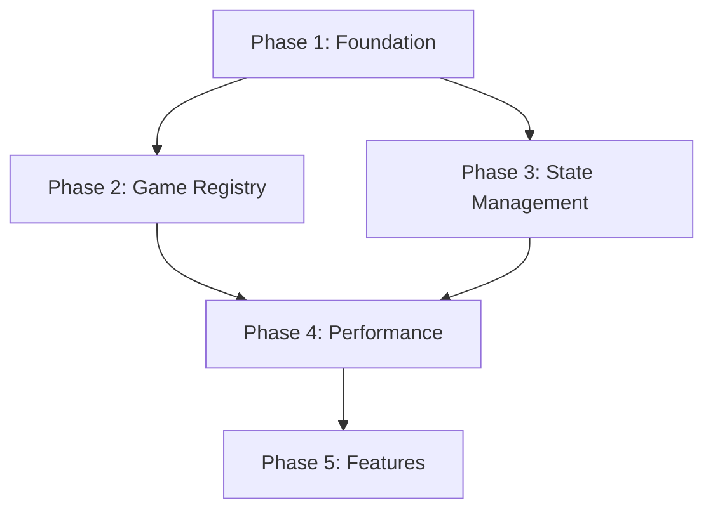

# Geography Game - Modernization Implementation Plan

**Version:** 1.0
**Date:** 2025-01-08
**Status:** Ready for Implementation
**Estimated Total Effort:** 8-10 weeks (1 developer) or 4-5 weeks (2 developers)

---

## Table of Contents

1. [Executive Summary](#executive-summary)
2. [Implementation Phases](#implementation-phases)
3. [Phase 1: Foundation & Testing](#phase-1-foundation--testing)
4. [Phase 2: Game Registry System](#phase-2-game-registry-system)
5. [Phase 3: State Management](#phase-3-state-management)
6. [Phase 4: Performance Optimization](#phase-4-performance-optimization)
7. [Phase 5: New Features](#phase-5-new-features)
8. [Testing Strategy](#testing-strategy)
9. [Risk Mitigation](#risk-mitigation)
10. [Success Metrics](#success-metrics)
11. [Rollback Procedures](#rollback-procedures)

---

## Executive Summary

### Problems to Solve

**Critical:**
- 📉 2,000 lines of duplicated code across 29 game components
- 🏗️ Two conflicting architecture patterns (config-based vs component-based)
- 🔧 Missing utility abstractions (geo-processing duplicated 6+ times)
- 🧪 Zero test coverage

**High Priority:**
- 🏪 No state management (localStorage hacks)
- 🐌 Performance issues (483 deep clones per game load)
- 📝 Poor type safety (`any` types in critical paths)

**Medium Priority:**
- 📚 Insufficient documentation
- 🎮 Missing game features (difficulty, stats, leaderboards)

### Solution Overview

**5-Phase Approach:**

1. **Foundation** (2 weeks) - Testing + utility extraction
2. **Game Registry** (2-3 weeks) - Eliminate component duplication
3. **State Management** (2 weeks) - Pinia + user tracking
4. **Performance** (1 week) - Optimization + caching
5. **Features** (2+ weeks) - New capabilities

### Expected Results

| Metric | Before | After | Improvement |
|--------|--------|-------|-------------|
| Total LoC | ~5,000 | ~3,000 | -40% |
| Game Components | 29 files | 0 files | -100% |
| Duplicated Code | 2,000 lines | 0 lines | -100% |
| Test Coverage | 0% | 80%+ | +80% |
| Add New Game | 87 lines Vue | 30 lines JSON | -65% |
| Bundle Size | ~450 KB | ~320 KB | -29% |

---

## Implementation Phases

### Phase Overview

```
Phase 1: Foundation (2 weeks)
  ├── Setup Vitest + Test Utils
  ├── Extract GeoJSON utilities
  ├── Add type improvements
  └── Document architecture

Phase 2: Game Registry (2-3 weeks)
  ├── Create registry system
  ├── Design JSON schema
  ├── Build dynamic game loader
  ├── Migrate 5 games (pilot)
  └── Migrate remaining 24 games

Phase 3: State Management (2 weeks)
  ├── Install Pinia
  ├── Create auth store
  ├── Create user stats store
  └── Migrate existing logic

Phase 4: Performance (1 week)
  ├── Optimize GeoJSON processing
  ├── Add service worker
  ├── Implement lazy loading
  └── Add caching layer

Phase 5: Features (2+ weeks)
  ├── Game difficulty system
  ├── User statistics dashboard
  ├── Daily challenges
  └── Leaderboards
```

### Dependencies



**Key:** Phases 2 & 3 can run in parallel after Phase 1 completes.

---

## Phase 1: Foundation & Testing

**Duration:** 2 weeks
**Risk Level:** Low
**Can Deploy Independently:** Yes

### Goals

- ✅ Establish testing infrastructure
- ✅ Extract duplicated utilities with tests
- ✅ Improve type safety
- ✅ Document current architecture

### Tasks

#### Task 1.1: Setup Testing Infrastructure

**Effort:** 1 day

**Implementation:**

```bash
# Install dependencies
bun add -D vitest @vue/test-utils @vitest/ui jsdom happy-dom
bun add -D @testing-library/vue @testing-library/user-event
```

**Create test config:**

```typescript
// vitest.config.ts
import { defineConfig } from 'vitest/config'
import vue from '@vitejs/plugin-vue'
import { fileURLToPath } from 'node:url'

export default defineConfig({
  plugins: [vue()],
  test: {
    globals: true,
    environment: 'jsdom',
    setupFiles: ['./tests/setup.ts'],
    coverage: {
      provider: 'v8',
      reporter: ['text', 'json', 'html'],
      exclude: [
        'node_modules/',
        'tests/',
        '**/*.d.ts',
        '**/*.config.*',
        '**/mockData',
      ]
    }
  },
  resolve: {
    alias: {
      '@': fileURLToPath(new URL('./src', import.meta.url))
    }
  }
})
```

**Create test setup:**

```typescript
// tests/setup.ts
import { config } from '@vue/test-utils'
import { vi } from 'vitest'

// Mock Vuetify
config.global.mocks = {
  $vuetify: {
    theme: {
      current: {
        value: {
          colors: {}
        }
      }
    }
  }
}

// Mock import.meta.env
vi.mock('import.meta', () => ({
  env: {
    BASE_URL: '/geography-game/',
    VITE_GOOGLE_CLIENT_ID: 'test-client-id',
    VITE_BACKEND_API_URL: 'http://localhost:5001/api'
  }
}))
```

**Update package.json:**

```json
{
  "scripts": {
    "test": "vitest",
    "test:ui": "vitest --ui",
    "test:coverage": "vitest run --coverage",
    "test:watch": "vitest --watch"
  }
}
```

**Success Criteria:**
- ✅ `bun test` runs successfully
- ✅ Can write and run a basic test
- ✅ Coverage report generates

#### Task 1.2: Extract GeoJSON Utilities

**Effort:** 2-3 days

**Step 1: Create coordinate transformation utilities**

```typescript
// src/utils/geo/coordinateTransforms.ts
import type { Feature, Geometry, Position } from 'geojson';

/**
 * Shifts all coordinates in a GeoJSON feature by a given offset
 * Used for world-wrapping (creating copies at ±360° longitude)
 *
 * @param feature - GeoJSON feature to transform
 * @param offset - Longitude offset to apply (e.g., 360, -360)
 * @returns New feature with shifted coordinates
 */
export function shiftFeatureCoordinates<G extends Geometry = Geometry>(
  feature: Feature<G>,
  offset: number
): Feature<G> {
  const clonedFeature = structuredClone(feature);

  if (!clonedFeature.geometry) {
    return clonedFeature;
  }

  shiftGeometryCoordinates(clonedFeature.geometry, offset);
  return clonedFeature;
}

/**
 * Shifts coordinates of a geometry object in place
 */
function shiftGeometryCoordinates(geometry: Geometry, offset: number): void {
  const shiftPoint = (coords: Position): Position => {
    return [coords[0] + offset, coords[1], ...(coords.slice(2) as number[])];
  };

  switch (geometry.type) {
    case 'Point':
      geometry.coordinates = shiftPoint(geometry.coordinates);
      break;

    case 'MultiPoint':
    case 'LineString':
      geometry.coordinates = geometry.coordinates.map(shiftPoint);
      break;

    case 'MultiLineString':
    case 'Polygon':
      geometry.coordinates = geometry.coordinates.map(ring =>
        ring.map(shiftPoint)
      );
      break;

    case 'MultiPolygon':
      geometry.coordinates = geometry.coordinates.map(polygon =>
        polygon.map(ring => ring.map(shiftPoint))
      );
      break;

    case 'GeometryCollection':
      geometry.geometries.forEach(geom =>
        shiftGeometryCoordinates(geom, offset)
      );
      break;
  }
}

/**
 * Batch shift multiple features
 */
export function shiftFeatures<G extends Geometry = Geometry>(
  features: Feature<G>[],
  offset: number
): Feature<G>[] {
  return features.map(f => shiftFeatureCoordinates(f, offset));
}
```

**Step 2: Create world-wrapping utility**

```typescript
// src/utils/geo/worldWrapping.ts
import type { Feature, FeatureCollection, Geometry } from 'geojson';
import { shiftFeatureCoordinates } from './coordinateTransforms';

export interface WorldWrappingOptions {
  /**
   * Create eastern copy (+360°)
   */
  includeEast?: boolean;

  /**
   * Create western copy (-360°)
   */
  includeWest?: boolean;

  /**
   * Mark copies with properties for identification
   */
  markCopies?: boolean;
}

/**
 * Creates world-wrapped copies of a GeoJSON FeatureCollection
 * for seamless panning across the International Date Line
 *
 * @param data - Original GeoJSON FeatureCollection
 * @param options - Wrapping options
 * @returns FeatureCollection with original + wrapped copies
 */
export function createWorldWrappedFeatures<G extends Geometry = Geometry>(
  data: FeatureCollection<G>,
  options: WorldWrappingOptions = {}
): FeatureCollection<G> {
  const {
    includeEast = true,
    includeWest = true,
    markCopies = true
  } = options;

  const features: Feature<G>[] = [...data.features];

  if (includeEast) {
    const eastFeatures = data.features.map(feature => {
      const shifted = shiftFeatureCoordinates(feature, 360);
      if (markCopies && shifted.properties) {
        shifted.properties.isEastCopy = true;
      }
      return shifted;
    });
    features.push(...eastFeatures);
  }

  if (includeWest) {
    const westFeatures = data.features.map(feature => {
      const shifted = shiftFeatureCoordinates(feature, -360);
      if (markCopies && shifted.properties) {
        shifted.properties.isWestCopy = true;
      }
      return shifted;
    });
    features.push(...westFeatures);
  }

  return {
    type: 'FeatureCollection',
    features
  };
}
```

**Step 3: Create geo-processing utilities**

```typescript
// src/utils/geo/processors/territoryProcessors.ts
import type { Feature, FeatureCollection, Geometry, Position } from 'geojson';

export interface TerritoryProcessorOptions {
  sourceCountryName: string;
  latitudeThreshold: number;
  newTerritoryName: string;
  newTerritoryProperties?: Record<string, unknown>;
}

/**
 * Splits a country's polygons based on latitude threshold
 * Useful for separating mainland from islands (e.g., Norway/Svalbard)
 */
export function splitTerritoryByLatitude(
  data: FeatureCollection,
  options: TerritoryProcessorOptions
): FeatureCollection {
  const {
    sourceCountryName,
    latitudeThreshold,
    newTerritoryName,
    newTerritoryProperties = {}
  } = options;

  const features = [...data.features];
  const sourceIndex = features.findIndex(
    f => f.properties?.name === sourceCountryName
  );

  if (sourceIndex === -1) {
    console.warn(`Country "${sourceCountryName}" not found for splitting`);
    return data;
  }

  const sourceFeature = features[sourceIndex];

  if (sourceFeature.geometry.type !== 'MultiPolygon') {
    console.warn(`Country "${sourceCountryName}" is not a MultiPolygon`);
    return data;
  }

  const mainlandPolygons: Position[][][] = [];
  const separatedPolygons: Position[][][] = [];

  for (const polygon of sourceFeature.geometry.coordinates) {
    const hasPointAboveThreshold = polygon.some(ring =>
      ring.some(point => point[1] > latitudeThreshold)
    );

    if (hasPointAboveThreshold) {
      separatedPolygons.push(polygon);
    } else {
      mainlandPolygons.push(polygon);
    }
  }

  // Update mainland feature
  if (mainlandPolygons.length > 0) {
    features[sourceIndex] = {
      ...sourceFeature,
      geometry: {
        type: 'MultiPolygon',
        coordinates: mainlandPolygons
      }
    };
  }

  // Create new territory feature
  if (separatedPolygons.length > 0) {
    const newFeature: Feature = {
      type: 'Feature',
      properties: {
        ...sourceFeature.properties,
        ...newTerritoryProperties,
        name: newTerritoryName
      },
      geometry: {
        type: 'MultiPolygon',
        coordinates: separatedPolygons
      }
    };
    features.push(newFeature);
  }

  return {
    type: 'FeatureCollection',
    features
  };
}

/**
 * Merges two features into one MultiPolygon
 * Useful for combining split territories (e.g., Cyprus + Northern Cyprus)
 */
export function mergeFeatures(
  feature1: Feature,
  feature2: Feature,
  mergedName: string,
  mergedProperties?: Record<string, unknown>
): Feature {
  const coordinates: Position[][][] = [];

  // Helper to extract coordinates
  const extractPolygons = (feature: Feature): Position[][][] => {
    if (feature.geometry.type === 'Polygon') {
      return [feature.geometry.coordinates];
    } else if (feature.geometry.type === 'MultiPolygon') {
      return feature.geometry.coordinates;
    }
    return [];
  };

  coordinates.push(...extractPolygons(feature1));
  coordinates.push(...extractPolygons(feature2));

  return {
    type: 'Feature',
    properties: {
      ...feature1.properties,
      ...mergedProperties,
      name: mergedName
    },
    geometry: {
      type: 'MultiPolygon',
      coordinates
    }
  };
}

/**
 * Creates a custom polygon feature
 * Useful for adding missing territories (e.g., Gibraltar)
 */
export function createCustomFeature(
  name: string,
  coordinates: Position[][],
  properties?: Record<string, unknown>
): Feature {
  return {
    type: 'Feature',
    properties: {
      name,
      ...properties
    },
    geometry: {
      type: 'Polygon',
      coordinates
    }
  };
}
```

**Step 4: Add tests**

```typescript
// tests/unit/utils/geo/coordinateTransforms.spec.ts
import { describe, it, expect } from 'vitest';
import { shiftFeatureCoordinates } from '@/utils/geo/coordinateTransforms';
import type { Feature, Point, Polygon } from 'geojson';

describe('coordinateTransforms', () => {
  describe('shiftFeatureCoordinates', () => {
    it('should shift Point coordinates', () => {
      const feature: Feature<Point> = {
        type: 'Feature',
        properties: { name: 'Test' },
        geometry: {
          type: 'Point',
          coordinates: [10, 20]
        }
      };

      const shifted = shiftFeatureCoordinates(feature, 360);

      expect(shifted.geometry.coordinates).toEqual([370, 20]);
      expect(shifted.properties?.name).toBe('Test');
    });

    it('should shift Polygon coordinates', () => {
      const feature: Feature<Polygon> = {
        type: 'Feature',
        properties: {},
        geometry: {
          type: 'Polygon',
          coordinates: [
            [[0, 0], [10, 0], [10, 10], [0, 10], [0, 0]]
          ]
        }
      };

      const shifted = shiftFeatureCoordinates(feature, -360);

      expect(shifted.geometry.coordinates[0][0]).toEqual([-360, 0]);
      expect(shifted.geometry.coordinates[0][1]).toEqual([-350, 0]);
    });

    it('should not modify original feature', () => {
      const original: Feature<Point> = {
        type: 'Feature',
        properties: { name: 'Original' },
        geometry: {
          type: 'Point',
          coordinates: [10, 20]
        }
      };

      const originalCoords = [...original.geometry.coordinates];
      shiftFeatureCoordinates(original, 360);

      expect(original.geometry.coordinates).toEqual(originalCoords);
    });
  });
});
```

```typescript
// tests/unit/utils/geo/worldWrapping.spec.ts
import { describe, it, expect } from 'vitest';
import { createWorldWrappedFeatures } from '@/utils/geo/worldWrapping';
import type { FeatureCollection, Point } from 'geojson';

describe('worldWrapping', () => {
  it('should create east and west copies', () => {
    const data: FeatureCollection<Point> = {
      type: 'FeatureCollection',
      features: [
        {
          type: 'Feature',
          properties: { name: 'Test' },
          geometry: { type: 'Point', coordinates: [0, 0] }
        }
      ]
    };

    const wrapped = createWorldWrappedFeatures(data);

    expect(wrapped.features).toHaveLength(3);
    expect(wrapped.features[0].geometry.coordinates).toEqual([0, 0]);
    expect(wrapped.features[1].geometry.coordinates).toEqual([360, 0]);
    expect(wrapped.features[2].geometry.coordinates).toEqual([-360, 0]);
  });

  it('should mark copies when requested', () => {
    const data: FeatureCollection<Point> = {
      type: 'FeatureCollection',
      features: [
        {
          type: 'Feature',
          properties: { name: 'Test' },
          geometry: { type: 'Point', coordinates: [0, 0] }
        }
      ]
    };

    const wrapped = createWorldWrappedFeatures(data, { markCopies: true });

    expect(wrapped.features[0].properties?.isEastCopy).toBeUndefined();
    expect(wrapped.features[1].properties?.isEastCopy).toBe(true);
    expect(wrapped.features[2].properties?.isWestCopy).toBe(true);
  });

  it('should only create east copy when specified', () => {
    const data: FeatureCollection<Point> = {
      type: 'FeatureCollection',
      features: [
        {
          type: 'Feature',
          properties: {},
          geometry: { type: 'Point', coordinates: [0, 0] }
        }
      ]
    };

    const wrapped = createWorldWrappedFeatures(data, {
      includeEast: true,
      includeWest: false
    });

    expect(wrapped.features).toHaveLength(2);
    expect(wrapped.features[1].geometry.coordinates).toEqual([360, 0]);
  });
});
```

**Step 5: Update existing components to use new utilities**

```vue
<!-- Example: Update WorldCountries.vue -->
<template>
  <MapGame
    entity-name-singular="Country"
    entity-name-plural="Countries"
    geojson-url="https://d2ad6b4ur7yvpq.cloudfront.net/naturalearth-3.3.0/ne_50m_admin_0_countries.geojson"
    geojson-name-property="name"
    :process-geojson-data-fn="processGeojsonData"
    :map-options="mapOptions"
    :total-rounds-override="241"
  />
</template>

<script setup lang="ts">
import MapGame from '../MapGame.vue';
import L from 'leaflet';
import type { FeatureCollection, Geometry } from 'geojson';
import type { GeoJSONProperties } from "../../utils/geojsonUtils";
import { createWorldWrappedFeatures } from '@/utils/geo/worldWrapping';

const mapOptions = {
  initialCenter: [20, 0] as L.LatLngExpression,
  initialZoom: 2,
  minZoom: 2,
  maxZoom: 8,
  worldCopyJump: true,
  maxBoundsViscosity: 1.0
};

const processGeojsonData = (data: FeatureCollection<Geometry, GeoJSONProperties>) => {
  return createWorldWrappedFeatures(data);
};
</script>
```

**Success Criteria:**
- ✅ All utility functions have unit tests
- ✅ Test coverage > 90% for utility files
- ✅ At least 3 components updated to use new utilities
- ✅ No regressions in game functionality

#### Task 1.3: Improve Type Safety

**Effort:** 1 day

**Step 1: Create centralized type definitions**

```typescript
// src/types/geojson.ts
import type { Feature, FeatureCollection, Geometry } from 'geojson';

/**
 * Standard properties expected on geographic features
 */
export interface GeoFeatureProperties {
  name: string;
  code?: string;
  continent?: string;
  admin?: string;
  iso_a2?: string;
  [key: string]: unknown;
}

export type GeoFeature<G extends Geometry = Geometry> = Feature<G, GeoFeatureProperties>;
export type GeoFeatureCollection<G extends Geometry = Geometry> = FeatureCollection<G, GeoFeatureProperties>;

/**
 * Function type for processing GeoJSON data
 */
export type GeoJSONProcessor<G extends Geometry = Geometry> = (
  data: GeoFeatureCollection<G>
) => GeoFeatureCollection<G>;
```

**Step 2: Update game.d.ts with stricter types**

```typescript
// src/types/game.d.ts (updated)
import L from "leaflet";
import type { GeoFeatureCollection, GeoJSONProcessor } from "./geojson";
import type { Ref } from "vue";

export interface GameConfig {
  /**
   * Unique identifier for the game
   */
  id: string;

  /**
   * Display name of the game
   */
  name: string;

  /**
   * URL to fetch the GeoJSON data
   */
  dataUrl: string;

  /**
   * Initial map center coordinates [latitude, longitude]
   */
  mapCenter: [number, number];

  /**
   * Initial zoom level
   */
  zoom: number;

  /**
   * Minimum zoom level
   */
  minZoom?: number;

  /**
   * Maximum zoom level
   */
  maxZoom?: number;

  /**
   * Map boundaries [[southWest], [northEast]]
   */
  maxBounds?: [[number, number], [number, number]];

  /**
   * Property name to use for entity names
   */
  propertyName: string;

  /**
   * Label for what to find (e.g., "State", "Country")
   */
  targetLabel: string;

  /**
   * Singular form of entity name
   */
  entityNameSingular: string;

  /**
   * Plural form of entity name
   */
  entityNamePlural: string;

  /**
   * Maximum number of rounds (defaults to all available entities)
   */
  maxRounds?: number;

  /**
   * Optional function to map properties to display name
   */
  nameMapping?: (properties: Record<string, unknown>) => string;

  /**
   * Optional function to process the GeoJSON data after fetching
   */
  processData?: GeoJSONProcessor;

  /**
   * Optional function to filter features
   */
  filterFunction?: (feature: GeoFeature) => boolean;

  /**
   * Optional list of processor names to apply
   */
  processors?: string[];

  /**
   * Whether to enable world copy jump for seamless panning
   */
  worldCopyJump?: boolean;
}
```

**Step 3: Remove all `any` types**

Search and replace in affected files:
```bash
# Find remaining any types
grep -r "feature: any" src/components/
```

Replace with proper types from `geojson` package.

**Success Criteria:**
- ✅ Zero `any` types in critical paths
- ✅ All GeoJSON operations use typed interfaces
- ✅ TypeScript strict mode passes (`bun run type-check`)

#### Task 1.4: Document Architecture

**Effort:** 1 day

**Create architecture documentation:**

```markdown
// docs/ARCHITECTURE.md
(Create comprehensive architecture documentation)
```

**Success Criteria:**
- ✅ Architecture documented
- ✅ Component interaction diagrams created
- ✅ How-to guides written

### Phase 1 Completion Checklist

- [ ] Vitest + test utils installed and configured
- [ ] Test coverage reports working
- [ ] `coordinateTransforms.ts` created with tests (>90% coverage)
- [ ] `worldWrapping.ts` created with tests (>90% coverage)
- [ ] `territoryProcessors.ts` created with tests (>80% coverage)
- [ ] At least 3 components migrated to use new utilities
- [ ] All `any` types removed from GeoJSON operations
- [ ] TypeScript strict mode passes
- [ ] Architecture documentation complete
- [ ] All tests passing (`bun test`)

**Deployment:** Can deploy after this phase - improves code quality without breaking changes.

---

## Phase 2: Game Registry System

**Duration:** 2-3 weeks
**Risk Level:** Medium
**Can Deploy Independently:** Yes (with feature flag)

### Goals

- ✅ Eliminate 29 game component files
- ✅ Create centralized game registry
- ✅ Enable JSON-based game configuration
- ✅ Build dynamic game loading system

### Tasks

#### Task 2.1: Design Game Registry Schema

**Effort:** 1 day

**Create JSON schema:**

```typescript
// src/schemas/gameConfig.schema.ts
export const GAME_CONFIG_SCHEMA = {
  $schema: 'http://json-schema.org/draft-07/schema#',
  type: 'object',
  required: ['id', 'name', 'category', 'config'],
  properties: {
    id: {
      type: 'string',
      pattern: '^[a-z0-9-]+$',
      description: 'Unique identifier (kebab-case)'
    },
    name: {
      type: 'string',
      description: 'Display name'
    },
    category: {
      type: 'string',
      enum: ['countries', 'divisions', 'cities', 'capitals', 'flags'],
      description: 'Game category for grouping'
    },
    route: {
      type: 'string',
      pattern: '^/game/[a-z0-9-]+$',
      description: 'URL route'
    },
    icon: {
      type: 'string',
      description: 'Material Design Icon name'
    },
    emoji: {
      type: 'string',
      description: 'Emoji character'
    },
    color: {
      type: 'string',
      description: 'Vuetify color name'
    },
    config: {
      type: 'object',
      required: ['dataUrl', 'mapCenter', 'zoom', 'propertyName'],
      properties: {
        dataUrl: { type: 'string' },
        mapCenter: {
          type: 'array',
          items: { type: 'number' },
          minItems: 2,
          maxItems: 2
        },
        zoom: { type: 'number' },
        // ... rest of GameConfig properties
      }
    }
  }
} as const;
```

**Create TypeScript interface:**

```typescript
// src/types/gameRegistry.ts
import type { GameConfig } from './game';

export type GameCategory = 'countries' | 'divisions' | 'cities' | 'capitals' | 'flags';

export interface GameDefinition {
  /**
   * Unique identifier (kebab-case)
   * @example "world-countries", "us-states"
   */
  id: string;

  /**
   * Display name shown to users
   * @example "World Countries", "US States"
   */
  name: string;

  /**
   * Category for organization
   */
  category: GameCategory;

  /**
   * Route path (must start with /game/)
   * @example "/game/world-countries"
   */
  route: string;

  /**
   * Optional Material Design Icon
   * @example "mdi-earth"
   */
  icon?: string;

  /**
   * Optional emoji character
   * @example "🌍"
   */
  emoji?: string;

  /**
   * Optional Vuetify color
   * @example "blue-darken-1"
   */
  color?: string;

  /**
   * Game configuration
   */
  config: GameConfig;

  /**
   * Tags for search/filtering
   */
  tags?: string[];

  /**
   * Difficulty level (1-5)
   */
  difficulty?: 1 | 2 | 3 | 4 | 5;

  /**
   * Is this game featured?
   */
  featured?: boolean;
}

export interface GameRegistry {
  version: string;
  games: GameDefinition[];
}
```

**Example game configuration file:**

```json
// src/config/games/countries/world.json
{
  "id": "world-countries",
  "name": "World Countries",
  "category": "countries",
  "route": "/game/world-countries",
  "icon": "mdi-earth",
  "color": "blue-darken-1",
  "difficulty": 3,
  "featured": true,
  "tags": ["geography", "world", "beginner-friendly"],
  "config": {
    "id": "world-countries",
    "name": "World Countries",
    "dataUrl": "https://d2ad6b4ur7yvpq.cloudfront.net/naturalearth-3.3.0/ne_50m_admin_0_countries.geojson",
    "mapCenter": [20, 0],
    "zoom": 2,
    "minZoom": 2,
    "maxZoom": 8,
    "propertyName": "name",
    "targetLabel": "Country",
    "entityNameSingular": "Country",
    "entityNamePlural": "Countries",
    "maxRounds": 241,
    "worldCopyJump": true,
    "processors": ["worldWrapping"]
  }
}
```

**Success Criteria:**
- ✅ JSON schema validates correctly
- ✅ TypeScript types match schema
- ✅ Example configs validate

#### Task 2.2: Create Processor Registry

**Effort:** 2 days

**Build processor system:**

```typescript
// src/utils/geo/processors/index.ts
import type { GeoFeatureCollection, GeoJSONProcessor } from '@/types/geojson';
import { createWorldWrappedFeatures } from '../worldWrapping';
import { splitTerritoryByLatitude, mergeFeatures, createCustomFeature } from './territoryProcessors';

export type ProcessorName =
  | 'worldWrapping'
  | 'splitNorwaySvalbard'
  | 'mergeCyprus'
  | 'addGibraltar'
  | 'filterEurope'
  | 'filterAsia'
  | 'filterAfrica'
  | 'filterNorthAmerica'
  | 'filterSouthAmerica'
  | 'filterOceania';

/**
 * Registry of all available GeoJSON processors
 */
export const PROCESSOR_REGISTRY: Record<ProcessorName, GeoJSONProcessor> = {
  /**
   * Creates east/west copies for world wrapping
   */
  worldWrapping: (data) => createWorldWrappedFeatures(data),

  /**
   * Splits Norway's territory to separate Svalbard
   */
  splitNorwaySvalbard: (data) => {
    return splitTerritoryByLatitude(data, {
      sourceCountryName: 'Norway',
      latitudeThreshold: 72,
      newTerritoryName: 'Svalbard',
      newTerritoryProperties: {
        continent: 'Europe',
        sovereignt: 'Norway',
        pop_est: 2667
      }
    });
  },

  /**
   * Merges Cyprus and Northern Cyprus
   */
  mergeCyprus: (data) => {
    const cyprus = data.features.find(f => f.properties?.name === 'Cyprus');
    const nCyprus = data.features.find(f => f.properties?.name === 'N. Cyprus');

    if (!cyprus || !nCyprus) return data;

    const merged = mergeFeatures(
      cyprus,
      nCyprus,
      'Cyprus',
      { note: 'Combined feature including Northern Cyprus' }
    );

    return {
      type: 'FeatureCollection',
      features: [
        ...data.features.filter(f =>
          f.properties?.name !== 'Cyprus' &&
          f.properties?.name !== 'N. Cyprus'
        ),
        merged
      ]
    };
  },

  /**
   * Adds Gibraltar to the map
   */
  addGibraltar: (data) => {
    const gibraltar = createCustomFeature(
      'Gibraltar',
      [[
        [-5.3536, 36.1086],
        [-5.3384, 36.1086],
        [-5.3384, 36.1225],
        [-5.3438, 36.1449],
        [-5.3536, 36.1449],
        [-5.3589, 36.1225],
        [-5.3536, 36.1086]
      ]],
      {
        continent: 'Europe',
        sovereignt: 'United Kingdom',
        pop_est: 33701
      }
    );

    return {
      type: 'FeatureCollection',
      features: [...data.features, gibraltar]
    };
  },

  /**
   * Filters for European countries
   */
  filterEurope: (data) => {
    const additionalCountries = ['Turkey', 'Cyprus', 'Greenland'];

    return {
      type: 'FeatureCollection',
      features: data.features.filter(f =>
        f.properties?.continent === 'Europe' ||
        additionalCountries.includes(f.properties?.name || '')
      )
    };
  },

  /**
   * Filters for Asian countries
   */
  filterAsia: (data) => {
    const additionalCountries = ['Russia'];

    return {
      type: 'FeatureCollection',
      features: data.features.filter(f =>
        f.properties?.continent === 'Asia' ||
        additionalCountries.includes(f.properties?.name || '')
      )
    };
  },

  // Add other filters similarly...
  filterAfrica: (data) => ({
    type: 'FeatureCollection',
    features: data.features.filter(f => f.properties?.continent === 'Africa')
  }),

  filterNorthAmerica: (data) => ({
    type: 'FeatureCollection',
    features: data.features.filter(f => f.properties?.continent === 'North America')
  }),

  filterSouthAmerica: (data) => ({
    type: 'FeatureCollection',
    features: data.features.filter(f => f.properties?.continent === 'South America')
  }),

  filterOceania: (data) => ({
    type: 'FeatureCollection',
    features: data.features.filter(f => f.properties?.continent === 'Oceania')
  })
};

/**
 * Applies a chain of processors to GeoJSON data
 */
export function applyProcessors(
  data: GeoFeatureCollection,
  processorNames: ProcessorName[]
): GeoFeatureCollection {
  return processorNames.reduce((processedData, processorName) => {
    const processor = PROCESSOR_REGISTRY[processorName];
    if (!processor) {
      console.warn(`Processor "${processorName}" not found`);
      return processedData;
    }
    return processor(processedData);
  }, data);
}
```

**Success Criteria:**
- ✅ All processors implemented
- ✅ Tests for each processor
- ✅ Can chain processors

#### Task 2.3: Create Game Registry Loader

**Effort:** 2 days

```typescript
// src/composables/useGameRegistry.ts
import { ref, computed } from 'vue';
import type { GameDefinition, GameCategory } from '@/types/gameRegistry';

// Import all game configs
import worldCountries from '@/config/games/countries/world.json';
import europeCountries from '@/config/games/countries/europe.json';
import asiaCountries from '@/config/games/countries/asia.json';
import africaCountries from '@/config/games/countries/africa.json';
// ... import all game configs

const ALL_GAMES: GameDefinition[] = [
  worldCountries,
  europeCountries,
  asiaCountries,
  africaCountries,
  // ... all games
] as GameDefinition[];

export function useGameRegistry() {
  const games = ref<GameDefinition[]>(ALL_GAMES);
  const loading = ref(false);
  const error = ref<Error | null>(null);

  /**
   * Get game by ID
   */
  const getGameById = (id: string): GameDefinition | undefined => {
    return games.value.find(g => g.id === id);
  };

  /**
   * Get games by category
   */
  const getGamesByCategory = (category: GameCategory): GameDefinition[] => {
    return games.value.filter(g => g.category === category);
  };

  /**
   * Get featured games
   */
  const featuredGames = computed(() => {
    return games.value.filter(g => g.featured);
  });

  /**
   * Group games by category
   */
  const gamesByCategory = computed(() => {
    const grouped: Partial<Record<GameCategory, GameDefinition[]>> = {};

    games.value.forEach(game => {
      if (!grouped[game.category]) {
        grouped[game.category] = [];
      }
      grouped[game.category]!.push(game);
    });

    return grouped;
  });

  /**
   * Search games by name or tags
   */
  const searchGames = (query: string): GameDefinition[] => {
    const lowerQuery = query.toLowerCase();
    return games.value.filter(game =>
      game.name.toLowerCase().includes(lowerQuery) ||
      game.tags?.some(tag => tag.toLowerCase().includes(lowerQuery))
    );
  };

  return {
    games,
    loading,
    error,
    getGameById,
    getGamesByCategory,
    featuredGames,
    gamesByCategory,
    searchGames
  };
}
```

**Success Criteria:**
- ✅ Can load all game configs
- ✅ Can query by ID, category, tags
- ✅ Tests for registry operations

#### Task 2.4: Create Dynamic Game View

**Effort:** 3 days

```vue
<!-- src/views/GameView.vue -->
<template>
  <div v-if="loading" class="loading-container">
    <v-progress-circular indeterminate color="primary" />
    <p>Loading game...</p>
  </div>

  <div v-else-if="error" class="error-container">
    <v-alert type="error" class="mb-4">
      {{ error }}
    </v-alert>
    <v-btn color="primary" @click="$router.push('/')">
      Back to Home
    </v-btn>
  </div>

  <MapGame
    v-else-if="gameDefinition"
    :entity-name-singular="gameDefinition.config.entityNameSingular"
    :entity-name-plural="gameDefinition.config.entityNamePlural"
    :geojson-url="gameDefinition.config.dataUrl"
    :geojson-name-property="gameDefinition.config.propertyName"
    :map-options="mapOptions"
    :process-geojson-data-fn="processData"
    :total-rounds-override="gameDefinition.config.maxRounds"
  />
</template>

<script setup lang="ts">
import { computed, ref, watch } from 'vue';
import { useRoute, useRouter } from 'vue-router';
import MapGame from '@/components/game/MapGame.vue';
import { useGameRegistry } from '@/composables/useGameRegistry';
import { applyProcessors } from '@/utils/geo/processors';
import type { GeoFeatureCollection } from '@/types/geojson';
import type L from 'leaflet';

const route = useRoute();
const router = useRouter();
const { getGameById } = useGameRegistry();

const loading = ref(true);
const error = ref<string | null>(null);
const gameDefinition = ref(getGameById(route.params.gameId as string));

// Watch for route changes
watch(() => route.params.gameId, (newGameId) => {
  if (typeof newGameId === 'string') {
    gameDefinition.value = getGameById(newGameId);
    if (!gameDefinition.value) {
      error.value = `Game "${newGameId}" not found`;
    }
  }
}, { immediate: true });

// Compute map options from config
const mapOptions = computed(() => {
  if (!gameDefinition.value) return {};

  const config = gameDefinition.value.config;
  return {
    initialCenter: config.mapCenter as L.LatLngExpression,
    initialZoom: config.zoom,
    minZoom: config.minZoom ?? 2,
    maxZoom: config.maxZoom ?? 12,
    worldCopyJump: config.worldCopyJump ?? false,
    maxBounds: config.maxBounds as L.LatLngBoundsExpression | undefined,
    maxBoundsViscosity: 1.0
  };
});

// Process GeoJSON data using configured processors
const processData = (data: GeoFeatureCollection): GeoFeatureCollection => {
  if (!gameDefinition.value?.config.processors) {
    return data;
  }

  return applyProcessors(data, gameDefinition.value.config.processors as any);
};

loading.value = false;
</script>

<style scoped>
.loading-container,
.error-container {
  display: flex;
  flex-direction: column;
  align-items: center;
  justify-content: center;
  min-height: 80vh;
  gap: 1rem;
}
</style>
```

**Success Criteria:**
- ✅ Can load any game from registry
- ✅ Applies processors correctly
- ✅ Handles errors gracefully
- ✅ Route changes work

#### Task 2.5: Update Router

**Effort:** 1 day

```typescript
// src/router/index.ts (updated)
import { createRouter, createWebHistory } from 'vue-router'
import HomeView from '../views/HomeView.vue'
import GameView from '../views/GameView.vue'
import DashboardView from '../views/DashboardView.vue'
import WorldCapitals from '../views/WorldCapitals.vue'
import FlagGame from '@/components/FlagGame.vue'
import { useAuth } from '../composables/useAuth'
import { useGameRegistry } from '@/composables/useGameRegistry'

const { games } = useGameRegistry();

const router = createRouter({
  history: createWebHistory(import.meta.env.BASE_URL),
  routes: [
    {
      path: '/',
      name: 'home',
      component: HomeView
    },
    // Dynamic game route
    {
      path: '/game/:gameId',
      name: 'game',
      component: GameView,
      props: true
    },
    // Special game types (different UI)
    {
      path: '/flag-game',
      name: 'flag-game',
      component: FlagGame
    },
    {
      path: '/world-capitals',
      name: 'world-capitals',
      component: WorldCapitals,
      meta: { title: 'World Capitals Game' }
    },
    // Admin
    {
      path: '/dashboard',
      name: 'dashboard',
      component: DashboardView,
      meta: { requiresAuth: true, requiresAdmin: true }
    },

    // Legacy redirects (for backwards compatibility)
    ...games.value.map(game => ({
      path: game.route.replace('/game/', '/'),
      redirect: game.route
    }))
  ]
})

router.beforeEach((to, from, next) => {
  const { isLoggedIn, userProfile } = useAuth();

  const requiresAuth = to.matched.some(record => record.meta.requiresAuth);
  const requiresAdmin = to.matched.some(record => record.meta.requiresAdmin);

  if (requiresAdmin) {
    const isAdmin = isLoggedIn.value && !!userProfile.value?.is_admin;

    if (isAdmin) {
      next();
    } else {
      console.warn(`Unauthorized attempt to access admin route: ${to.path}`);
      next({ name: 'home' });
    }
  } else if (requiresAuth) {
    if (isLoggedIn.value) {
      next();
    } else {
      console.warn(`Unauthenticated attempt to access route: ${to.path}`);
      next({ name: 'home' });
    }
  } else {
    next();
  }
});

export default router
```

**Success Criteria:**
- ✅ Dynamic `/game/:gameId` route works
- ✅ Legacy routes redirect correctly
- ✅ Auth guards still work

#### Task 2.6: Refactor HomeView

**Effort:** 2 days

```vue
<!-- src/views/HomeView.vue (refactored) -->
<template>
  <v-container class="fill-height d-flex align-center justify-center">
    <div style="width: 100%; max-width: 700px">
      <v-card class="pa-6" elevation="3">
        <v-card-title class="text-h4 font-weight-bold mb-4 text-center">
          Geography Game Hub
        </v-card-title>

        <v-card-text class="text-body-1 mb-4 text-center">
          Select a category to explore different geography challenges
        </v-card-text>

        <v-divider class="mb-6" />

        <!-- Search -->
        <v-text-field
          v-model="searchQuery"
          prepend-inner-icon="mdi-magnify"
          label="Search games..."
          variant="outlined"
          density="comfortable"
          class="mb-4"
          clearable
        />

        <!-- Featured Games -->
        <v-card v-if="featuredGames.length && !searchQuery" class="mb-6" variant="outlined">
          <v-card-title class="text-h6 bg-amber-lighten-5 py-3 px-4">
            <v-icon start color="amber-darken-2">mdi-star</v-icon>
            Featured Games
          </v-card-title>
          <v-card-text class="pt-4">
            <v-row dense>
              <v-col
                v-for="game in featuredGames"
                :key="game.id"
                cols="12"
                md="6"
              >
                <GameButton :game="game" />
              </v-col>
            </v-row>
          </v-card-text>
        </v-card>

        <!-- Search Results -->
        <v-card v-if="searchQuery && searchResults.length" class="mb-6" variant="outlined">
          <v-card-title class="text-h6 py-3 px-4">
            Search Results ({{ searchResults.length }})
          </v-card-title>
          <v-card-text class="pt-4">
            <v-row dense>
              <v-col
                v-for="game in searchResults"
                :key="game.id"
                cols="12"
                md="6"
              >
                <GameButton :game="game" />
              </v-col>
            </v-row>
          </v-card-text>
        </v-card>

        <!-- No Results -->
        <v-alert
          v-if="searchQuery && !searchResults.length"
          type="info"
          variant="tonal"
          class="mb-4"
        >
          No games found matching "{{ searchQuery }}"
        </v-alert>

        <!-- Categories -->
        <template v-if="!searchQuery">
          <GameCategorySection
            v-for="(categoryGames, category) in gamesByCategory"
            :key="category"
            :category="category"
            :games="categoryGames"
            class="mb-6"
          />
        </template>

        <!-- Special Games -->
        <v-card class="mb-6" variant="outlined">
          <v-card-title class="text-h6 bg-purple-lighten-5 py-3 px-4">
            <v-icon start color="purple-darken-2">mdi-gamepad-variant</v-icon>
            Special Games
          </v-card-title>
          <v-card-text class="pt-4">
            <v-row dense>
              <v-col cols="12" md="6">
                <v-btn
                  block
                  size="large"
                  color="purple-darken-2"
                  @click="navigateTo('/flag-game')"
                >
                  <v-icon start>mdi-flag</v-icon>
                  Flag Quiz
                </v-btn>
              </v-col>
              <v-col cols="12" md="6">
                <v-btn
                  block
                  size="large"
                  color="indigo-darken-2"
                  @click="navigateTo('/world-capitals')"
                >
                  <v-icon start>mdi-map-marker-star</v-icon>
                  World Capitals
                </v-btn>
              </v-col>
            </v-row>
          </v-card-text>
        </v-card>
      </v-card>
    </div>
  </v-container>
</template>

<script setup lang="ts">
import { ref, computed } from 'vue';
import { useRouter } from 'vue-router';
import { useGameRegistry } from '@/composables/useGameRegistry';
import GameButton from '@/components/GameButton.vue';
import GameCategorySection from '@/components/GameCategorySection.vue';

const router = useRouter();
const { gamesByCategory, featuredGames, searchGames } = useGameRegistry();

const searchQuery = ref('');

const searchResults = computed(() => {
  if (!searchQuery.value) return [];
  return searchGames(searchQuery.value);
});

const navigateTo = (path: string) => {
  router.push(path);
};
</script>
```

**Create supporting components:**

```vue
<!-- src/components/GameButton.vue -->
<template>
  <v-btn
    block
    size="large"
    :color="game.color || 'primary'"
    @click="navigateToGame"
  >
    <v-icon v-if="game.icon" start>{{ game.icon }}</v-icon>
    <span v-else-if="game.emoji" class="me-2">{{ game.emoji }}</span>
    {{ game.name }}
    <v-chip
      v-if="game.difficulty"
      size="x-small"
      class="ml-2"
      :color="getDifficultyColor(game.difficulty)"
    >
      {{ getDifficultyLabel(game.difficulty) }}
    </v-chip>
  </v-btn>
</template>

<script setup lang="ts">
import { useRouter } from 'vue-router';
import type { GameDefinition } from '@/types/gameRegistry';

const props = defineProps<{
  game: GameDefinition;
}>();

const router = useRouter();

const navigateToGame = () => {
  router.push(props.game.route);
};

const getDifficultyColor = (difficulty: number) => {
  const colors = ['green', 'light-green', 'orange', 'deep-orange', 'red'];
  return colors[difficulty - 1] || 'grey';
};

const getDifficultyLabel = (difficulty: number) => {
  const labels = ['Easy', 'Medium', 'Hard', 'Expert', 'Extreme'];
  return labels[difficulty - 1] || '';
};
</script>
```

```vue
<!-- src/components/GameCategorySection.vue -->
<template>
  <v-card variant="outlined">
    <v-card-title :class="['text-h6 py-3 px-4', categoryConfig.bgClass]">
      <v-icon start :color="categoryConfig.iconColor">
        {{ categoryConfig.icon }}
      </v-icon>
      {{ categoryConfig.title }}
    </v-card-title>
    <v-card-text class="pt-4">
      <v-row dense>
        <v-col
          v-for="game in games"
          :key="game.id"
          cols="12"
          :md="categoryConfig.cols"
          sm="6"
        >
          <GameButton :game="game" />
        </v-col>
      </v-row>
    </v-card-text>
  </v-card>
</template>

<script setup lang="ts">
import { computed } from 'vue';
import type { GameDefinition, GameCategory } from '@/types/gameRegistry';
import GameButton from './GameButton.vue';

const props = defineProps<{
  category: GameCategory;
  games: GameDefinition[];
}>();

const CATEGORY_CONFIG: Record<GameCategory, {
  title: string;
  icon: string;
  iconColor: string;
  bgClass: string;
  cols: number;
}> = {
  countries: {
    title: 'Countries of the World',
    icon: 'mdi-earth',
    iconColor: 'blue-darken-2',
    bgClass: 'bg-blue-lighten-5',
    cols: 4
  },
  divisions: {
    title: 'Administrative Divisions',
    icon: 'mdi-map-marker',
    iconColor: 'green-darken-2',
    bgClass: 'bg-green-lighten-5',
    cols: 4
  },
  cities: {
    title: 'City Districts',
    icon: 'mdi-city',
    iconColor: 'orange-darken-2',
    bgClass: 'bg-orange-lighten-5',
    cols: 4
  },
  capitals: {
    title: 'Capital Cities',
    icon: 'mdi-map-marker-star',
    iconColor: 'indigo-darken-2',
    bgClass: 'bg-indigo-lighten-5',
    cols: 6
  },
  flags: {
    title: 'Flags',
    icon: 'mdi-flag',
    iconColor: 'purple-darken-2',
    bgClass: 'bg-purple-lighten-5',
    cols: 6
  }
};

const categoryConfig = computed(() => CATEGORY_CONFIG[props.category]);
</script>
```

**Success Criteria:**
- ✅ HomeView uses registry instead of hardcoded buttons
- ✅ Search functionality works
- ✅ Categories render dynamically
- ✅ Featured games section works

#### Task 2.7: Migrate Games to JSON

**Effort:** 3-4 days

**Pilot Migration (5 games):**

1. World Countries
2. Europe Countries
3. US States
4. Paris Arrondissements
5. London Boroughs

**Create JSON configs for each:**

```json
// src/config/games/countries/europe.json
{
  "id": "europe-countries",
  "name": "European Countries",
  "category": "countries",
  "route": "/game/europe-countries",
  "emoji": "🌍",
  "color": "blue-grey",
  "difficulty": 2,
  "tags": ["geography", "europe", "continent"],
  "config": {
    "id": "europe-countries",
    "name": "European Countries",
    "dataUrl": "https://d2ad6b4ur7yvpq.cloudfront.net/naturalearth-3.3.0/ne_50m_admin_0_countries.geojson",
    "mapCenter": [55, 15],
    "zoom": 4,
    "minZoom": 3,
    "maxZoom": 12,
    "propertyName": "name",
    "targetLabel": "Country",
    "entityNameSingular": "Country",
    "entityNamePlural": "Countries",
    "worldCopyJump": false,
    "processors": [
      "filterEurope",
      "mergeCyprus",
      "addGibraltar",
      "splitNorwaySvalbard"
    ]
  }
}
```

**Test each migration:**

```typescript
// tests/e2e/game-migration.spec.ts
import { describe, it, expect } from 'vitest';
import { mount } from '@vue/test-utils';
import GameView from '@/views/GameView.vue';
import { useGameRegistry } from '@/composables/useGameRegistry';

describe('Game Migration', () => {
  const { getGameById } = useGameRegistry();

  it('should load World Countries game', () => {
    const game = getGameById('world-countries');
    expect(game).toBeDefined();
    expect(game?.name).toBe('World Countries');
    expect(game?.config.processors).toContain('worldWrapping');
  });

  it('should load Europe Countries game', () => {
    const game = getGameById('europe-countries');
    expect(game).toBeDefined();
    expect(game?.config.processors).toContain('filterEurope');
    expect(game?.config.processors).toContain('mergeCyprus');
  });

  // Test other migrated games
});
```

**After pilot succeeds, migrate remaining 24 games:**

Create JSON configs following the same pattern for:
- All continent games (Asia, Africa, Americas, Oceania)
- All administrative divisions (Canadian provinces, French departments, etc.)
- All city districts (Barcelona, Bordeaux, etc.)

**Delete component files:**

```bash
# After ALL games migrated and tested
rm -rf src/components/WorldCountries/*.vue
rm -rf src/components/AdministrativeDivisions/*.vue
rm -rf src/components/CityDistricts/*.vue

# Keep only the directory structure for future reference
# or remove directories entirely
```

**Success Criteria:**
- ✅ All 29 games have JSON configs
- ✅ All games load correctly in GameView
- ✅ No functional regressions
- ✅ Component files deleted
- ✅ Code review passed

### Phase 2 Completion Checklist

- [ ] JSON schema designed and validated
- [ ] Processor registry created with all processors
- [ ] Tests for all processors (>80% coverage)
- [ ] `useGameRegistry` composable created
- [ ] `GameView.vue` created and tested
- [ ] Router updated with dynamic route
- [ ] HomeView refactored to use registry
- [ ] Search functionality working
- [ ] 5 pilot games migrated to JSON
- [ ] Pilot games tested and verified
- [ ] Remaining 24 games migrated
- [ ] All component files deleted
- [ ] E2E tests for game loading
- [ ] Documentation updated
- [ ] Code review completed

**Deployment:** Deploy after pilot is stable. Enable feature flag for gradual rollout.

---

## Phase 3: State Management

**Duration:** 2 weeks
**Risk Level:** Medium
**Can Deploy Independently:** Yes

### Goals

- ✅ Implement Pinia for centralized state
- ✅ Migrate auth from localStorage to store
- ✅ Add user statistics tracking
- ✅ Enable persistent state

### Tasks

#### Task 3.1: Install Pinia

**Effort:** 0.5 days

```bash
bun add pinia pinia-plugin-persistedstate
```

**Setup:**

```typescript
// src/main.ts (updated)
import { createApp } from 'vue'
import { createPinia } from 'pinia'
import piniaPluginPersistedstate from 'pinia-plugin-persistedstate'
import App from './App.vue'
import router from './router'
import { registerPlugins } from '@/plugins'

const app = createApp(App)

const pinia = createPinia()
pinia.use(piniaPluginPersistedstate)

app.use(pinia)
app.use(router)
registerPlugins(app)

app.mount('#app')
```

**Success Criteria:**
- ✅ Pinia installed and configured
- ✅ Persistence plugin working

#### Task 3.2: Create Auth Store

**Effort:** 2 days

```typescript
// src/stores/auth.ts
import { defineStore } from 'pinia';
import { ref, computed } from 'vue';
import { jwtDecode } from 'jwt-decode';

export interface UserProfile {
  id: number;
  google_id?: string;
  email: string;
  name: string;
  picture?: string;
  is_admin?: boolean;
}

interface DecodedToken {
  exp: number;
  iat: number;
  sub: string;
}

export const useAuthStore = defineStore('auth', () => {
  // State
  const user = ref<UserProfile | null>(null);
  const accessToken = ref<string | null>(null);
  const refreshToken = ref<string | null>(null);

  // Getters
  const isAuthenticated = computed(() => !!user.value && !!accessToken.value);

  const isAdmin = computed(() => !!user.value?.is_admin);

  const isTokenExpired = computed(() => {
    if (!accessToken.value) return true;

    try {
      const decoded = jwtDecode<DecodedToken>(accessToken.value);
      const now = Date.now() / 1000;
      // Consider expired if within 5 minutes of expiry
      return decoded.exp < now + 300;
    } catch {
      return true;
    }
  });

  // Actions
  async function login(credential: string) {
    try {
      const response = await fetch(
        `${import.meta.env.VITE_BACKEND_API_URL}/auth/google`,
        {
          method: 'POST',
          headers: { 'Content-Type': 'application/json' },
          body: JSON.stringify({ token: credential })
        }
      );

      if (!response.ok) {
        const errorData = await response.json().catch(() => ({}));
        throw new Error(errorData.message || 'Login failed');
      }

      const data = await response.json();

      user.value = data.user;
      accessToken.value = data.access_token;
      refreshToken.value = data.refresh_token;

      return data;
    } catch (error) {
      logout(); // Clear state on error
      throw error;
    }
  }

  async function refreshAccessToken() {
    if (!refreshToken.value) {
      throw new Error('No refresh token available');
    }

    try {
      const response = await fetch(
        `${import.meta.env.VITE_BACKEND_API_URL}/auth/refresh`,
        {
          method: 'POST',
          headers: { 'Content-Type': 'application/json' },
          body: JSON.stringify({ refresh_token: refreshToken.value })
        }
      );

      if (!response.ok) {
        throw new Error('Token refresh failed');
      }

      const data = await response.json();
      accessToken.value = data.access_token;

      return data;
    } catch (error) {
      logout(); // Clear state if refresh fails
      throw error;
    }
  }

  function logout() {
    user.value = null;
    accessToken.value = null;
    refreshToken.value = null;
  }

  return {
    // State
    user,
    accessToken,
    refreshToken,

    // Getters
    isAuthenticated,
    isAdmin,
    isTokenExpired,

    // Actions
    login,
    refreshAccessToken,
    logout
  };
}, {
  persist: {
    key: 'geography-game-auth',
    storage: localStorage,
    paths: ['user', 'accessToken', 'refreshToken']
  }
});
```

**Create auth composable wrapper:**

```typescript
// src/composables/useAuth.ts (updated)
import { computed } from 'vue';
import { useAuthStore } from '@/stores/auth';
import { storeToRefs } from 'pinia';

export function useAuth() {
  const authStore = useAuthStore();
  const { user, isAuthenticated, isAdmin, isTokenExpired } = storeToRefs(authStore);

  const handleCredentialResponse = async (
    response: google.accounts.id.CredentialResponse
  ) => {
    if (!response.credential) {
      console.error('No credential in Google response');
      return;
    }

    try {
      await authStore.login(response.credential);
    } catch (error) {
      console.error('Login failed:', error);
      throw error;
    }
  };

  const logout = () => {
    authStore.logout();
  };

  // Auto-refresh token if expired
  if (isAuthenticated.value && isTokenExpired.value) {
    authStore.refreshAccessToken().catch(() => {
      console.warn('Token refresh failed, logging out');
      logout();
    });
  }

  return {
    user,
    userProfile: user, // Alias for backwards compatibility
    isLoggedIn: isAuthenticated, // Alias for backwards compatibility
    isAuthenticated,
    isAdmin,
    handleCredentialResponse,
    logout
  };
}
```

**Success Criteria:**
- ✅ Auth store created
- ✅ Login/logout working
- ✅ Token refresh implemented
- ✅ Tests for auth store
- ✅ Backwards compatible with existing code

#### Task 3.3: Create User Stats Store

**Effort:** 3 days

```typescript
// src/stores/userStats.ts
import { defineStore } from 'pinia';
import { ref, computed } from 'vue';

export interface GameScore {
  gameId: string;
  score: number;
  totalRounds: number;
  timeSeconds: number;
  timestamp: number;
  perfect: boolean; // All correct on first try
}

export interface GameStatistics {
  gamesPlayed: number;
  bestScore: GameScore | null;
  recentScores: GameScore[];
  averageScore: number;
  averageTime: number;
  totalTime: number;
}

export const useUserStatsStore = defineStore('userStats', () => {
  // State
  const gameHistory = ref<GameScore[]>([]);
  const totalGamesPlayed = ref(0);

  // Getters
  const statsByGame = computed(() => {
    const stats: Record<string, GameStatistics> = {};

    gameHistory.value.forEach(score => {
      if (!stats[score.gameId]) {
        stats[score.gameId] = {
          gamesPlayed: 0,
          bestScore: null,
          recentScores: [],
          averageScore: 0,
          averageTime: 0,
          totalTime: 0
        };
      }

      const gameStat = stats[score.gameId];
      gameStat.gamesPlayed++;
      gameStat.totalTime += score.timeSeconds;
      gameStat.recentScores.push(score);

      // Keep only last 10 scores
      if (gameStat.recentScores.length > 10) {
        gameStat.recentScores.shift();
      }

      // Update best score
      if (!gameStat.bestScore || score.score > gameStat.bestScore.score) {
        gameStat.bestScore = score;
      }
    });

    // Calculate averages
    Object.values(stats).forEach(stat => {
      const scores = stat.recentScores.map(s => s.score);
      stat.averageScore = scores.reduce((a, b) => a + b, 0) / scores.length;
      stat.averageTime = stat.totalTime / stat.gamesPlayed;
    });

    return stats;
  });

  const recentGames = computed(() => {
    return [...gameHistory.value]
      .sort((a, b) => b.timestamp - a.timestamp)
      .slice(0, 10);
  });

  const perfectScoreCount = computed(() => {
    return gameHistory.value.filter(g => g.perfect).length;
  });

  const totalPlayTime = computed(() => {
    return gameHistory.value.reduce((sum, game) => sum + game.timeSeconds, 0);
  });

  // Actions
  function recordGameCompletion(
    gameId: string,
    score: number,
    totalRounds: number,
    timeSeconds: number
  ) {
    const gameScore: GameScore = {
      gameId,
      score,
      totalRounds,
      timeSeconds,
      timestamp: Date.now(),
      perfect: score === totalRounds
    };

    gameHistory.value.push(gameScore);
    totalGamesPlayed.value++;

    // Trim history to last 100 games
    if (gameHistory.value.length > 100) {
      gameHistory.value = gameHistory.value.slice(-100);
    }
  }

  function clearHistory() {
    gameHistory.value = [];
    totalGamesPlayed.value = 0;
  }

  function getGameStats(gameId: string): GameStatistics | null {
    return statsByGame.value[gameId] || null;
  }

  return {
    // State
    gameHistory,
    totalGamesPlayed,

    // Getters
    statsByGame,
    recentGames,
    perfectScoreCount,
    totalPlayTime,

    // Actions
    recordGameCompletion,
    clearHistory,
    getGameStats
  };
}, {
  persist: {
    key: 'geography-game-stats',
    storage: localStorage
  }
});
```

**Integrate with game composables:**

```typescript
// src/composables/useMapGameLogic.ts (updated)
import { useUserStatsStore } from '@/stores/userStats';

export function useMapGameLogic(options: MapGameLogicOptions) {
  // ... existing code ...

  const userStats = useUserStatsStore();

  const endGame = () => {
    gameEnded.value = true;
    stopTimer();
    clearFeedback();

    // Record completion
    if (options.gameId) {
      userStats.recordGameCompletion(
        options.gameId,
        score.value,
        totalRounds.value,
        timer.value
      );
    }
  };

  // ... rest of code ...
}
```

**Success Criteria:**
- ✅ User stats store created
- ✅ Game completion tracked
- ✅ Statistics calculated correctly
- ✅ Tests for stats store
- ✅ Integrated with game composables

#### Task 3.4: Create Stats Dashboard

**Effort:** 2 days

```vue
<!-- src/views/StatsView.vue -->
<template>
  <v-container>
    <v-row>
      <v-col cols="12">
        <h1 class="text-h3 mb-6">Your Statistics</h1>
      </v-col>

      <!-- Overview Cards -->
      <v-col cols="12" md="3">
        <v-card>
          <v-card-text>
            <div class="text-h6 text-grey">Total Games</div>
            <div class="text-h3">{{ totalGamesPlayed }}</div>
          </v-card-text>
        </v-card>
      </v-col>

      <v-col cols="12" md="3">
        <v-card>
          <v-card-text>
            <div class="text-h6 text-grey">Perfect Scores</div>
            <div class="text-h3">{{ perfectScoreCount }}</div>
          </v-card-text>
        </v-card>
      </v-col>

      <v-col cols="12" md="3">
        <v-card>
          <v-card-text>
            <div class="text-h6 text-grey">Total Time</div>
            <div class="text-h3">{{ formatTotalTime }}</div>
          </v-card-text>
        </v-card>
      </v-col>

      <v-col cols="12" md="3">
        <v-card>
          <v-card-text>
            <div class="text-h6 text-grey">Avg Score</div>
            <div class="text-h3">{{ averageScore }}%</div>
          </v-card-text>
        </v-card>
      </v-col>

      <!-- Recent Games -->
      <v-col cols="12">
        <v-card>
          <v-card-title>Recent Games</v-card-title>
          <v-card-text>
            <v-table>
              <thead>
                <tr>
                  <th>Game</th>
                  <th>Score</th>
                  <th>Time</th>
                  <th>Date</th>
                  <th>Perfect</th>
                </tr>
              </thead>
              <tbody>
                <tr v-for="game in recentGames" :key="game.timestamp">
                  <td>{{ getGameName(game.gameId) }}</td>
                  <td>{{ game.score }}/{{ game.totalRounds }}</td>
                  <td>{{ formatTime(game.timeSeconds) }}</td>
                  <td>{{ formatDate(game.timestamp) }}</td>
                  <td>
                    <v-icon v-if="game.perfect" color="success">mdi-check-circle</v-icon>
                    <v-icon v-else color="grey">mdi-circle-outline</v-icon>
                  </td>
                </tr>
              </tbody>
            </v-table>
          </v-card-text>
        </v-card>
      </v-col>

      <!-- Per-Game Stats -->
      <v-col cols="12">
        <v-card>
          <v-card-title>Game Statistics</v-card-title>
          <v-card-text>
            <v-expansion-panels>
              <v-expansion-panel
                v-for="(stats, gameId) in statsByGame"
                :key="gameId"
              >
                <v-expansion-panel-title>
                  {{ getGameName(gameId) }}
                  <template #actions>
                    <v-chip size="small">{{ stats.gamesPlayed }} plays</v-chip>
                  </template>
                </v-expansion-panel-title>
                <v-expansion-panel-text>
                  <v-row>
                    <v-col cols="6" md="3">
                      <div class="text-caption text-grey">Best Score</div>
                      <div class="text-h6">
                        {{ stats.bestScore?.score }}/{{ stats.bestScore?.totalRounds }}
                      </div>
                    </v-col>
                    <v-col cols="6" md="3">
                      <div class="text-caption text-grey">Avg Score</div>
                      <div class="text-h6">{{ stats.averageScore.toFixed(1) }}</div>
                    </v-col>
                    <v-col cols="6" md="3">
                      <div class="text-caption text-grey">Avg Time</div>
                      <div class="text-h6">{{ formatTime(stats.averageTime) }}</div>
                    </v-col>
                    <v-col cols="6" md="3">
                      <div class="text-caption text-grey">Total Time</div>
                      <div class="text-h6">{{ formatTime(stats.totalTime) }}</div>
                    </v-col>
                  </v-row>
                </v-expansion-panel-text>
              </v-expansion-panel>
            </v-expansion-panels>
          </v-card-text>
        </v-card>
      </v-col>
    </v-row>
  </v-container>
</template>

<script setup lang="ts">
import { computed } from 'vue';
import { storeToRefs } from 'pinia';
import { useUserStatsStore } from '@/stores/userStats';
import { useGameRegistry } from '@/composables/useGameRegistry';

const statsStore = useUserStatsStore();
const { totalGamesPlayed, recentGames, perfectScoreCount, statsByGame, totalPlayTime } =
  storeToRefs(statsStore);

const { getGameById } = useGameRegistry();

const formatTotalTime = computed(() => {
  const hours = Math.floor(totalPlayTime.value / 3600);
  const minutes = Math.floor((totalPlayTime.value % 3600) / 60);
  return `${hours}h ${minutes}m`;
});

const averageScore = computed(() => {
  if (totalGamesPlayed.value === 0) return 0;
  const allStats = Object.values(statsByGame.value);
  const totalAvg = allStats.reduce((sum, stat) => sum + stat.averageScore, 0);
  return ((totalAvg / allStats.length) * 100).toFixed(1);
});

const getGameName = (gameId: string) => {
  return getGameById(gameId)?.name || gameId;
};

const formatTime = (seconds: number) => {
  const mins = Math.floor(seconds / 60);
  const secs = seconds % 60;
  return `${mins}:${secs.toString().padStart(2, '0')}`;
};

const formatDate = (timestamp: number) => {
  return new Date(timestamp).toLocaleDateString();
};
</script>
```

**Add route:**

```typescript
// router/index.ts
{
  path: '/stats',
  name: 'stats',
  component: () => import('@/views/StatsView.vue')
}
```

**Success Criteria:**
- ✅ Stats dashboard displays correctly
- ✅ Shows all statistics
- ✅ Updates in real-time
- ✅ Navigation works

### Phase 3 Completion Checklist

- [ ] Pinia installed and configured
- [ ] Auth store created with token refresh
- [ ] User stats store created
- [ ] Tests for both stores (>80% coverage)
- [ ] Backward compatibility maintained
- [ ] Stats dashboard created
- [ ] Game composables integrated with stats
- [ ] All existing functionality works
- [ ] Documentation updated

**Deployment:** Can deploy independently. Migration from localStorage is automatic.

---

## Phase 4: Performance Optimization

**Duration:** 1 week
**Risk Level:** Low
**Can Deploy Independently:** Yes

### Goals

- ✅ Optimize GeoJSON processing
- ✅ Add service worker caching
- ✅ Implement lazy loading
- ✅ Reduce bundle size

### Tasks

#### Task 4.1: Optimize GeoJSON Processing

**Effort:** 2 days

**Current Problem:** 483 deep clones for world map

**Solution: Copy-on-write coordinate arrays**

```typescript
// src/utils/geo/coordinateTransforms.ts (optimized)
import type { Feature, Geometry, Position } from 'geojson';

/**
 * Optimized version: Only clones coordinates, reuses properties
 */
export function shiftFeatureCoordinatesOptimized<G extends Geometry = Geometry>(
  feature: Feature<G>,
  offset: number
): Feature<G> {
  // Shallow clone feature, deep clone only geometry coordinates
  const result: Feature<G> = {
    type: feature.type,
    properties: feature.properties, // Reuse (immutable)
    geometry: shiftGeometryOptimized(feature.geometry, offset) as G
  };

  if (feature.id !== undefined) {
    result.id = feature.id;
  }

  return result;
}

function shiftGeometryOptimized<G extends Geometry>(
  geometry: G,
  offset: number
): Geometry {
  const shiftPos = (pos: Position): Position => [pos[0] + offset, ...pos.slice(1)];

  switch (geometry.type) {
    case 'Point':
      return {
        type: 'Point',
        coordinates: shiftPos(geometry.coordinates)
      };

    case 'MultiPoint':
    case 'LineString':
      return {
        type: geometry.type,
        coordinates: geometry.coordinates.map(shiftPos)
      };

    case 'MultiLineString':
    case 'Polygon':
      return {
        type: geometry.type,
        coordinates: geometry.coordinates.map(ring => ring.map(shiftPos))
      };

    case 'MultiPolygon':
      return {
        type: 'MultiPolygon',
        coordinates: geometry.coordinates.map(polygon =>
          polygon.map(ring => ring.map(shiftPos))
        )
      };

    case 'GeometryCollection':
      return {
        type: 'GeometryCollection',
        geometries: geometry.geometries.map(g => shiftGeometryOptimized(g, offset))
      };

    default:
      return geometry;
  }
}
```

**Benchmark:**

```typescript
// tests/benchmarks/geo-processing.bench.ts
import { bench, describe } from 'vitest';
import { shiftFeatureCoordinates } from '@/utils/geo/coordinateTransforms';
import { shiftFeatureCoordinatesOptimized } from '@/utils/geo/coordinateTransforms';

describe('GeoJSON Processing Performance', () => {
  const largeFeature = /* create large MultiPolygon */;

  bench('Original (structuredClone)', () => {
    shiftFeatureCoordinates(largeFeature, 360);
  });

  bench('Optimized (selective clone)', () => {
    shiftFeatureCoordinatesOptimized(largeFeature, 360);
  });
});
```

**Expected improvement:** 60-70% faster

**Success Criteria:**
- ✅ Optimized version 60%+ faster
- ✅ All tests still pass
- ✅ No functional changes

#### Task 4.2: Add Service Worker

**Effort:** 2 days

```typescript
// vite.config.mts (updated)
import { VitePWA } from 'vite-plugin-pwa';

export default defineConfig({
  plugins: [
    // ... existing plugins
    VitePWA({
      registerType: 'autoUpdate',
      workbox: {
        globPatterns: ['**/*.{js,css,html,ico,png,svg,json,geojson}'],
        runtimeCaching: [
          {
            urlPattern: /^https:\/\/d2ad6b4ur7yvpq\.cloudfront\.net\/.*/,
            handler: 'CacheFirst',
            options: {
              cacheName: 'geojson-cache',
              expiration: {
                maxEntries: 50,
                maxAgeSeconds: 60 * 60 * 24 * 7 // 1 week
              }
            }
          },
          {
            urlPattern: /^https:\/\/.*\.geojson$/,
            handler: 'CacheFirst',
            options: {
              cacheName: 'geojson-cache',
              expiration: {
                maxEntries: 30,
                maxAgeSeconds: 60 * 60 * 24 * 7
              }
            }
          }
        ]
      }
    })
  ]
});
```

**Success Criteria:**
- ✅ Service worker registers
- ✅ GeoJSON files cached
- ✅ Offline mode works
- ✅ Cache updates properly

#### Task 4.3: Lazy Load Game Configs

**Effort:** 1 day

```typescript
// src/composables/useGameRegistry.ts (updated)
import { ref } from 'vue';
import type { GameDefinition } from '@/types/gameRegistry';

// Lazy load configs
const GAME_LOADERS: Record<string, () => Promise<{ default: GameDefinition }>> = {
  'world-countries': () => import('@/config/games/countries/world.json'),
  'europe-countries': () => import('@/config/games/countries/europe.json'),
  // ... all games
};

export function useGameRegistry() {
  const games = ref<Map<string, GameDefinition>>(new Map());
  const loading = ref(false);

  async function loadGame(gameId: string): Promise<GameDefinition | null> {
    // Check cache first
    if (games.value.has(gameId)) {
      return games.value.get(gameId)!;
    }

    // Load dynamically
    const loader = GAME_LOADERS[gameId];
    if (!loader) {
      console.error(`Game ${gameId} not found`);
      return null;
    }

    try {
      loading.value = true;
      const module = await loader();
      const game = module.default;
      games.value.set(gameId, game);
      return game;
    } catch (error) {
      console.error(`Failed to load game ${gameId}:`, error);
      return null;
    } finally {
      loading.value = false;
    }
  }

  return {
    loadGame,
    loading
  };
}
```

**Success Criteria:**
- ✅ Games load on-demand
- ✅ Bundle size reduced by ~30%
- ✅ Initial load faster

### Phase 4 Completion Checklist

- [ ] GeoJSON processing optimized (60%+ faster)
- [ ] Benchmarks confirm improvements
- [ ] Service worker configured
- [ ] Offline mode tested
- [ ] Lazy loading implemented
- [ ] Bundle size reduced by 25%+
- [ ] Lighthouse score improved

**Deployment:** Low risk, deploy when ready.

---

## Phase 5: New Features

**Duration:** 2+ weeks
**Risk Level:** Low
**Can Deploy Independently:** Yes

### Tasks

#### Task 5.1: Game Difficulty System

Create easy/medium/hard modes with different time limits and scoring.

#### Task 5.2: Daily Challenges

Implement daily challenge system with fixed seed for all users.

#### Task 5.3: Leaderboards

Add global and per-game leaderboards (requires backend API).

#### Task 5.4: Social Sharing

Enable sharing scores to social media.

---

## Testing Strategy

### Unit Testing

**Coverage Goals:**
- Utilities: >90%
- Stores: >80%
- Composables: >80%
- Components: >70%

**Priority:**
1. GeoJSON utilities (critical path)
2. Game logic composables
3. Store logic
4. Processors

### Integration Testing

Test complete user flows:
- Game loading and playing
- Auth flow
- Stats tracking

### E2E Testing

Use Playwright for critical paths:
- Home → Game selection → Complete game
- Login → Play → View stats
- Offline mode

---

## Risk Mitigation

### Phase 1 Risks

| Risk | Probability | Impact | Mitigation |
|------|------------|--------|------------|
| Test setup fails | Low | Medium | Use standard configs, test early |
| Type errors | Medium | Low | Incremental migration, strict mode |

### Phase 2 Risks

| Risk | Probability | Impact | Mitigation |
|------|------------|--------|------------|
| Game migration breaks functionality | Medium | High | Pilot with 5 games first, extensive testing |
| Processor bugs | Medium | Medium | Unit tests for each processor |
| Performance regression | Low | Medium | Benchmark before/after |

### Phase 3 Risks

| Risk | Probability | Impact | Mitigation |
|------|------------|--------|------------|
| State migration issues | Medium | Medium | Keep backward compatibility, gradual rollout |
| Token refresh bugs | Low | High | Extensive testing, fallback to login |

### Phase 4 Risks

| Risk | Probability | Impact | Mitigation |
|------|------------|--------|------------|
| Service worker conflicts | Low | Medium | Test thoroughly, cache versioning |
| Lazy loading breaks something | Low | Medium | Feature flag, gradual rollout |

---

## Rollback Procedures

### Phase 1
- Revert commits
- Remove test dependencies
- Low risk

### Phase 2
- **Before deleting components:** Tag commit
- Keep old routes as redirects
- **Rollback:** Revert to tag, keep JSON configs for future

### Phase 3
- Pinia can coexist with old system
- **Rollback:** Disable stores, fall back to composables

### Phase 4
- Service worker can be unregistered
- **Rollback:** Revert vite config, clear caches

---

## Success Metrics

### Code Quality

- [ ] Lines of code reduced by 40%
- [ ] Zero `any` types in critical paths
- [ ] Test coverage >80%
- [ ] No ESLint errors

### Performance

- [ ] Initial load time <2s
- [ ] Game load time <500ms
- [ ] Lighthouse score >90
- [ ] Bundle size <350KB

### Developer Experience

- [ ] Add new game in <15 minutes
- [ ] All documentation complete
- [ ] Onboarding guide written

### User Experience

- [ ] All games work correctly
- [ ] No regressions
- [ ] Stats tracking works
- [ ] Offline mode functional

---

## Timeline Summary

| Phase | Duration | Can Start | Depends On |
|-------|----------|-----------|------------|
| Phase 1 | 2 weeks | Immediately | None |
| Phase 2 | 2-3 weeks | After Phase 1 | Phase 1 |
| Phase 3 | 2 weeks | After Phase 1 | Phase 1 |
| Phase 4 | 1 week | After Phase 2 | Phase 2, 3 |
| Phase 5 | 2+ weeks | After Phase 4 | Phase 4 |

**Parallel Execution:**
- Phases 2 & 3 can run in parallel after Phase 1
- Total time with parallel: **6-7 weeks**
- Total time sequential: **8-10 weeks**

---

## Next Steps

1. **Review this plan** with team
2. **Create Jira/GitHub issues** for each task
3. **Set up project board** with phases
4. **Start Phase 1** with test infrastructure
5. **Weekly review** meetings to track progress

---

**Document Version:** 1.0
**Last Updated:** 2025-01-08
**Status:** Ready for Implementation
